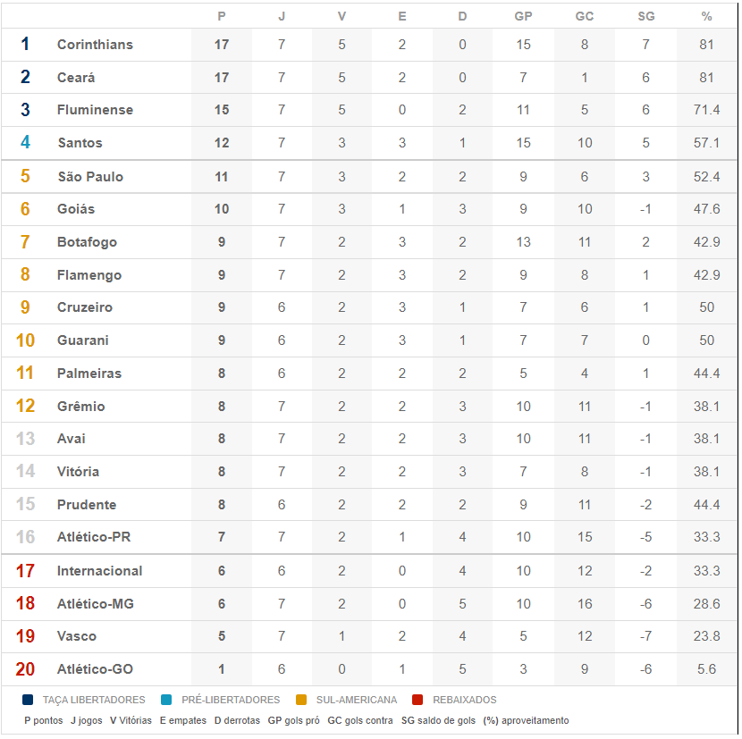

# Tabela

Uma página desenvolvida utilizando HTML e CSS constituída de uma tabela centralizada, com dados tabulados referentes à classificação do Campeonato ACME de 2022, no dia 31/12/2022, às 23h:59min. 

<h1>Tecnologias</h1>

<ul>
    <li>HTML</li>
    <li>CSS</li>
</ul>

<h1>Hospedagem</h1>

